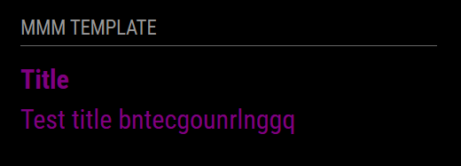

# MMM-WebcamImage

*MMM-WebcamImage* is a module for [MagicMirror²](https://github.com/MagicMirrorOrg/MagicMirror) that periodically fetches and displays an image from a given URL, bypassing browser cache on every refresh.

## Screenshot



## Installation

### Install

In your terminal, go to the modules directory and clone the repository:

```bash
cd ~/MagicMirror/modules
git clone https://github.com/igor-semenov/MMM-WebcamImage
```

### Update

Go to the module directory and pull the latest changes:

```bash
cd ~/MagicMirror/modules/MMM-WebcamImage
git pull
```

## Configuration

To use this module, add a configuration object to the modules array in `config/config.js`.

### Example configuration

Minimal configuration:

```js
{
    module: "MMM-WebcamImage",
    position: "top_right",
    config: {
        url: "http://example.com/webcam.jpg"
    }
},
```

Configuration with all options:

```js
{
    module: "MMM-WebcamImage",
    position: "top_right",
    config: {
        url: "http://example.com/webcam.jpg",
        refreshInterval: 1000,
        width: "400px",
        height: "300px"
    }
},
```

### Configuration options

Option|Possible values|Default|Description
------|------|------|-----------
`url`|`string`|`""`|URL of the image to display
`refreshInterval`|`number`|`1000`|Refresh interval in milliseconds
`width`|`string` or `null`|`null`|CSS width of the image (e.g. `"400px"`). If `null`, the image's natural width is used
`height`|`string` or `null`|`null`|CSS height of the image (e.g. `"300px"`). If `null`, the image's natural height is used

## Developer commands

- `npm install` - Install devDependencies like ESLint.
- `node --run lint` - Run linting and formatter checks.
- `node --run lint:fix` - Fix linting and formatter issues.
- `./check.sh` - Run all quality checks locally.
- `./check.sh --fix` - Run quality checks and auto-fix issues.

## License

This project is licensed under the MIT License - see the [LICENSE](LICENSE.md) file for details.

## Changelog

All notable changes to this project will be documented in the [CHANGELOG.md](CHANGELOG.md) file.
